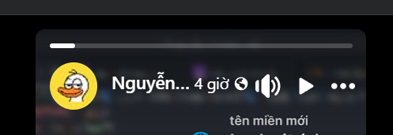
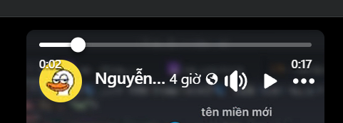

# Thanh Seek Tùy Chỉnh cho Facebook Stories

### 🌐 Ngôn ngữ: Tiếng Việt | [English](./docs/README.en.md)

Thêm **thanh seek kéo được** và **hiển thị thời gian** cho Facebook Stories.

> Script này có **2 cách sử dụng**:
>
> 1) Cài như **Tampermonkey userscript** (khuyến nghị, nhanh gọn)
> 2) Cài như **Chrome Extension** (dành cho người không dùng Tampermonkey)

<table>
  <tr>
    <td><a href="#tong-quan">Tổng quan</a></td>
  </tr>
  <tr>
    <td>&emsp;<a href="#cach-1-tampermonkey-userscript">Cách 1: Tampermonkey (Userscript)</a></td>
  </tr>
  <tr>
    <td>&emsp;<a href="#cach-2-chrome-extension">Cách 2: Chrome Extension</a></td>
  </tr>
  <tr>
    <td>&emsp;<a href="#xem-truoc">Xem trước</a></td>
  </tr>
  <tr>
    <td>&emsp;<a href="#cau-hoi-thuong-gap">Câu hỏi thường gặp</a></td>
  </tr>
  <tr>
    <td>&emsp;&emsp;<a href="#tai-sao-doi-khi-keo-seek-khong-hoat-dong">Tại sao đôi khi kéo seek không hoạt động?</a></td>
  </tr>
  <tr>
    <td>&emsp;&emsp;<a href="#facebook-doi-giao-dien-co-bi-hong-khong">Facebook đổi giao diện có bị hỏng không?</a></td>
  </tr>
</table>

## Hướng dẫn nhanh

  
<b>Tôi muốn cài nhanh bằng Tampermonkey</b> (Click để mở)

  <ol>
    <li>Cài <a href="https://www.tampermonkey.net/" target="_blank" rel="noopener noreferrer">Tampermonkey</a> trên Chrome/Edge.</li>
    <li><b>Cài một lần nhấp:</b> mở link sau để Tampermonkey tự nhận và hỏi cài đặt:</li>
  </ol>
  

    <a href="https://raw.githubusercontent.com/DuckCIT/custom-fb-story-seekbar/main/userscript/custom_fb_stories_seekbar.user.js" target="_blank" rel="noopener noreferrer"><b>Cài Custom FB Stories Seekbar</b></a>
  

  <ol start="3">
    <li>Nhấn <b>Install</b> trong Tampermonkey.</li>
    <li>Refresh Facebook và vào <code>https://www.facebook.com/stories/...</code></li>
  </ol>

  
<b>Tôi không dùng Tampermonkey, muốn cài như extension</b> (Click để mở)

  <ol>
    <li>Tải project về máy (ZIP) hoặc <code>git clone</code>.</li>
    <li>Mở <code>chrome://extensions</code> trên Chrome.</li>
    <li>Bật <b>Chế độ dành cho nhà phát triển (Developer mode)</b>.</li>
    <li>Chọn <b>Load unpacked</b>.</li>
    <li>Chọn thư mục <code>extension/</code> (nơi chứa <code>manifest.json</code>).</li>
  </ol>

## Tổng quan

Khi bạn xem Facebook Stories, script sẽ:

- **Ẩn thanh tiến trình gốc** của Facebook.
- Thêm **thanh seek tùy chỉnh** (có thể kéo để tua) và **hiển thị thời gian** (current/total).

## Cách 1: Tampermonkey (Userscript)

### Bước 1: Cài Tampermonkey

- Chrome: https://chrome.google.com/webstore/detail/tampermonkey/dhdgffkkebhmkfjojejmpbldmpobfkfo  
- Edge: https://microsoftedge.microsoft.com/addons/detail/tampermonkey/iikmkjmpaadaobahmlepeloendndfphd

### Bước 2: Cài một lần nhấp (khuyến nghị)

Mở link:  
- **Install:** `userscript/custom_fb_stories_seekbar.user.js`  

Tampermonkey sẽ tự nhận và hiển thị màn hình cài đặt.

**Link cài trực tiếp (GitHub Raw):**
- https://raw.githubusercontent.com/DuckCIT/custom-fb-story-seekbar/main/userscript/custom_fb_stories_seekbar.user.js

## Cách 2: Chrome Extension

### Cách cài (Load unpacked)

1. Tải repo về máy (Download ZIP) hoặc clone.
2. Mở `chrome://extensions`.
3. Bật **Chế độ dành cho nhà phát triển**.
4. Chọn **Load unpacked**.
5. Chọn thư mục `extension/` (nơi có `manifest.json`).

## Xem trước

### Trước

### Sau

## Câu hỏi thường gặp

### Tại sao đôi khi kéo seek không hoạt động?

Facebook là SPA và có thể render nhiều `<video>` cùng lúc (video ẩn/preview/cũ), nên code kiểu `document.querySelector('video')` đôi khi bám nhầm video.

### Facebook đổi giao diện có bị hỏng không?

Có thể. Script đang bám theo class CSS của Facebook cho container thanh tiến trình. Facebook đổi class/layout có thể khiến script không tìm thấy đúng container.
